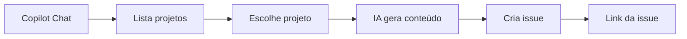

# 🚀 Quick Start Guide - Varejo CRM MCP

Guia rápido para começar a usar a extensão em **5 minutos**.

## 📋 Pré-requisitos

- ✅ VS Code instalado (`code --version`)
- ✅ Python 3.8+ instalado (`python3 --version`)
- ✅ GitLab Personal Access Token ([como obter](#1-obter-gitlab-token))

---

## 1️⃣ Obter GitLab Token

1. Acesse: http://gitlab.dimed.com.br/-/user_settings/personal_access_tokens

2. Clique em **"Add new token"**

3. Configure:
   - **Name**: `VS Code MCP`
   - **Scopes**: `api`, `read_user`, `write_repository`
   - **Expiration**: 1 ano

4. **Copie o token** (só aparece uma vez!)

---

## 2️⃣ Instalar Extensão

### Opção A: Script Automático ⭐ Recomendado

```bash
curl -sL http://gitlab.dimed.com.br/grupopanvel/varejo/crm/varejo-crm-mcp/-/raw/main/scripts/install.sh | bash
```

### Opção B: Manual

```bash
# 1. Baixe o .vsix do GitLab Releases
# http://gitlab.dimed.com.br/grupopanvel/varejo/crm/varejo-crm-mcp/-/releases

# 2. Instale
code --install-extension varejo-crm-mcp-1.0.0.vsix
```

---

## 3️⃣ Configurar

1. **Reinicie o VS Code**

2. Um wizard abrirá automaticamente. Preencha:
   - **GitLab URL**: `http://gitlab.dimed.com.br/api/v4`
   - **Token**: Cole o token copiado no passo 1
   - **Grupo**: `grupopanvel/varejo/crm`
   - **Assignee**: Seu username GitLab

3. Clique em **OK** em todos os prompts

✅ **Pronto!** Você verá no status bar: `✔️ CRM MCP`

---

## 4️⃣ Usar com Copilot

Abra o **Copilot Chat**: `Ctrl+Shift+I` (ou `Cmd+Shift+I` no Mac)

### Exemplos:

**Criar uma User Story:**
```
@workspace crie uma US no projeto Acompanhamento sobre implementar cache Redis para melhorar performance das consultas de clientes
```

**Listar projetos:**
```
@workspace liste os projetos GitLab do CRM
```

**Ver template:**
```
@workspace mostre o template de issues do GitLab
```

**Criar um Bug:**
```
@workspace crie um BUG no projeto authorization-service sobre falha no login com tokens expirados
```

---

## 🎯 Fluxo Típico



1. **Você pede**: "crie uma US no projeto X sobre Y"
2. **IA lista**: Todos os projetos disponíveis
3. **Você escolhe**: O projeto correto da lista
4. **IA gera**: Título + descrição completos
5. **IA cria**: Issue no GitLab
6. **Você recebe**: Link direto da issue criada

---

## ⚙️ Configurações Avançadas

### Reconfigurar

Command Palette (`Cmd+Shift+P`):
```
Varejo CRM: Configurar GitLab
```

### Ver Logs

`View → Output → Varejo CRM MCP Server`

### Parar Servidor

Reinicie o VS Code ou use Command Palette:
```
Developer: Reload Window
```

---

## 🐛 Problemas Comuns

### ❌ "Servidor MCP não iniciado"

1. Verifique os logs: `View → Output → Varejo CRM MCP Server`
2. Confirme Python: `python3 --version`
3. Reconfigure: `Varejo CRM: Configurar GitLab`

### ❌ "Token inválido"

1. Verifique se o token tem os scopes corretos: `api`, `read_user`, `write_repository`
2. Gere um novo token se necessário
3. Reconfigure: `Varejo CRM: Configurar GitLab`

### ❌ "Projeto não encontrado"

Use o nome **exato** da lista:
```
@workspace liste os projetos GitLab
```
Copie e cole o nome exato do projeto.

---

## 🎓 Próximos Passos

- 📖 Leia o [README completo](README.md)
- 🔍 Veja o [CHANGELOG](CHANGELOG.md)
- 🐛 Reporte bugs em [Issues](http://gitlab.dimed.com.br/grupopanvel/varejo/crm/varejo-crm-mcp/-/issues)

---

**Dúvidas?** Pergunte no canal do time ou abra uma issue! 🚀
